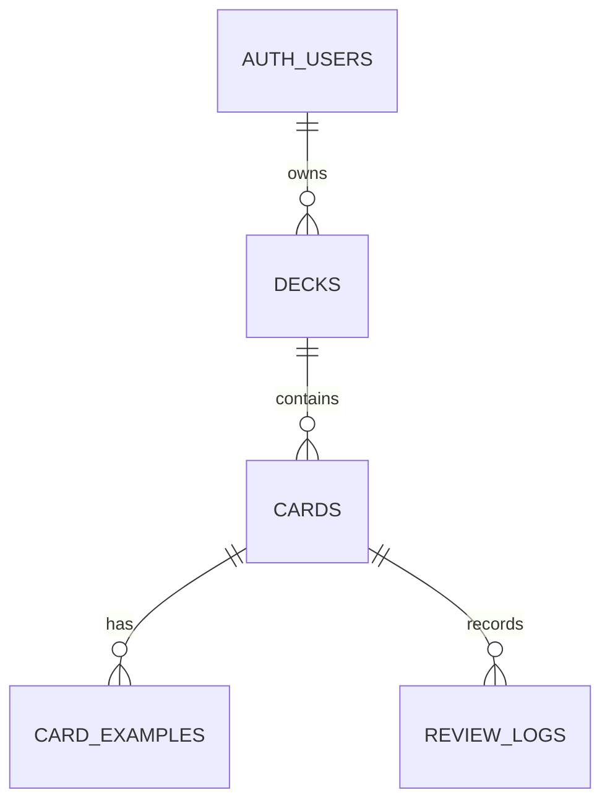

# 데이터仕様書 (Data Specification)

> **프로젝트:** J-Flashcard  
> **문서 버전:** v1.0  
> **기준:** `supabase/migrations/`의 현재 migration 전체 적용 결과

## 1. 목적과 범위

이 문서는 J-Flashcard가 사용하는 Supabase 데이터 구조와 데이터 규칙을 정의한다.

- 데이터베이스: PostgreSQL via Supabase
- 인증: Supabase Auth
- 애플리케이션 테이블: `decks`, `cards`, `card_examples`, `review_logs`
- 사용자 정보의 기준: `auth.users`
- DB 컬럼명: snake_case
- ID: UUID
- 일시: PostgreSQL `timestamptz`, API에서는 ISO 8601 문자열로 전달

## 2. 사용자와 인증

애플리케이션은 별도의 `users` 테이블을 만들지 않는다. 사용자는 Supabase가 관리하는 `auth.users`의 행으로 식별한다.

| 항목              | 규칙                                                     |
| ----------------- | -------------------------------------------------------- |
| 사용자 ID         | `auth.users.id`의 UUID                                   |
| 로그인 정보       | Supabase Auth가 관리                                     |
| 비밀번호 해시     | 애플리케이션 테이블에 저장하지 않음                      |
| 애플리케이션 참조 | `decks.user_id`, `review_logs.user_id`                   |
| 회원가입          | 첫 릴리스에서는 UI를 제공하지 않고 사전 생성 계정을 사용 |

애플리케이션 코드에서 로그인 사용자를 참조할 때는 Supabase Auth 세션의 `user.id`를 사용한다.

## 3. 엔터티 관계



- `decks.user_id`는 `auth.users.id`를 참조한다.
- `cards.deck_id`는 `decks.id`를 참조한다.
- `card_examples.card_id`는 `cards.id`를 참조한다.
- `review_logs.card_id`는 `cards.id`를 참조하지만 카드 삭제 후 `null`이 될 수 있다.
- 카드와 예문은 JSON 배열이 아니라 별도 테이블에 저장한다.

## 4. 공통 규칙

### 4.1 ID와 일시

- 모든 애플리케이션 테이블의 기본 키는 `uuid`이며 기본값은 `gen_random_uuid()`다.
- `created_at`은 생성 시각이며 기본값은 `now()`다.
- `decks.updated_at`과 `cards.updated_at`은 update trigger로 변경 시각을 갱신한다.
- 복습 시각은 `review_logs.reviewed_at`에 저장한다.

### 4.2 Enum

`public.anki_rating`:

```text
again | hard | good | easy
```

`public.card_state`:

```text
new | learning | review | relearning
```

### 4.3 Nullable과 입력 정책

- DB에서 `not null`인 컬럼은 저장 시 필수다.
- `text` 타입이면서 `not null`이 아닌 컬럼은 `null`을 허용한다.
- 빈 문자열을 자동으로 `null`로 바꾸는지는 폼/API 계층의 입력 규칙으로 정한다.
- 예문은 0개 이상 저장할 수 있다.
- 예문이 존재하는 경우 `text`와 `meaning`은 필수이고 `reading`은 선택이다.

## 5. 테이블 사양

### 5.1 `decks`

사용자가 소유하는 단어 덱이다.

| 컬럼          | PostgreSQL 타입 | Null | 기본값              | 설명                         |
| ------------- | --------------- | ---- | ------------------- | ---------------------------- |
| `id`          | `uuid`          | 불가 | `gen_random_uuid()` | 덱 ID                        |
| `user_id`     | `uuid`          | 불가 | 없음                | 소유자. `auth.users.id` 참조 |
| `title`       | `text`          | 불가 | 없음                | 덱 이름                      |
| `description` | `text`          | 가능 | 없음                | 덱 설명                      |
| `created_at`  | `timestamptz`   | 불가 | `now()`             | 생성 시각                    |
| `updated_at`  | `timestamptz`   | 불가 | `now()`             | 최종 수정 시각               |

인덱스:

- `decks_user_id_idx` on (`user_id`)

입력 규칙:

- `title`은 필수다.
- `description`은 선택이다.
- `title`과 `description`에는 최대 문자 수 제한이 없다.
- 같은 사용자가 동일한 이름의 덱을 여러 개 생성할 수 있다.

### 5.2 `cards`

덱에 포함되는 일본어 단어와 현재 FSRS 상태다.

| 컬럼             | PostgreSQL 타입    | Null | 기본값              | 설명                      |
| ---------------- | ------------------ | ---- | ------------------- | ------------------------- |
| `id`             | `uuid`             | 불가 | `gen_random_uuid()` | 카드 ID                   |
| `deck_id`        | `uuid`             | 불가 | 없음                | 소속 덱                   |
| `word`           | `text`             | 불가 | 없음                | 일본어 표기               |
| `reading`        | `text`             | 가능 | 없음                | 단어 읽기                 |
| `meaning`        | `text`             | 불가 | 없음                | 한국어 뜻                 |
| `part_of_speech` | `text`             | 불가 | 없음                | 품사                      |
| `state`          | `card_state`       | 불가 | `new`               | 현재 FSRS 카드 상태       |
| `stability`      | `double precision` | 불가 | `0`                 | FSRS 기억 안정성          |
| `difficulty`     | `double precision` | 불가 | `0`                 | FSRS 난이도               |
| `scheduled_days` | `double precision` | 불가 | `0`                 | 다음 복습까지의 예정 일수 |
| `reps`           | `integer`          | 불가 | `0`                 | 반복 학습 횟수            |
| `lapses`         | `integer`          | 불가 | `0`                 | 실패 횟수                 |
| `due`            | `timestamptz`      | 불가 | `now()`             | 다음 복습 예정 시각       |
| `last_review`    | `timestamptz`      | 가능 | 없음                | 마지막 복습 시각          |
| `created_at`     | `timestamptz`      | 불가 | `now()`             | 생성 시각                 |
| `updated_at`     | `timestamptz`      | 불가 | `now()`             | 최종 수정 시각            |

인덱스:

- `cards_deck_id_idx` on (`deck_id`)
- `cards_due_idx` on (`due`)

입력 및 변경 규칙:

- `word`, `meaning`, `part_of_speech`, `deck_id`는 필수다.
- `reading`은 선택이다.
- `word`, `reading`, `meaning`, `part_of_speech`에는 최대 문자 수 제한이 없다.
- 새 카드는 FSRS 기본값으로 생성한다.
- 카드 내용 수정 시 FSRS 상태 컬럼은 변경하지 않는다.
- 학습 평가에 따른 FSRS 상태 변경은 스케줄러 처리에서 수행한다.

> `scheduled_days`, `reps`, `due`, `last_review`는 초기 migration의 이름에서 후속 migration으로 변경된 최종 컬럼명이다.

### 5.3 `card_examples`

카드에 연결된 예문이다. 한 카드에 여러 예문을 저장할 수 있다.

| 컬럼         | PostgreSQL 타입 | Null | 기본값              | 설명           |
| ------------ | --------------- | ---- | ------------------- | -------------- |
| `id`         | `uuid`          | 불가 | `gen_random_uuid()` | 예문 ID        |
| `card_id`    | `uuid`          | 불가 | 없음                | 소속 카드      |
| `text`       | `text`          | 불가 | 없음                | 일본어 예문    |
| `reading`    | `text`          | 가능 | 없음                | 예문 읽기      |
| `meaning`    | `text`          | 불가 | 없음                | 예문 한국어 뜻 |
| `sort_order` | `integer`       | 불가 | `0`                 | 표시 순서      |
| `created_at` | `timestamptz`   | 불가 | `now()`             | 생성 시각      |

인덱스:

- `card_examples_card_id_idx` on (`card_id`)

입력 규칙:

- 예문 목록 자체는 선택이다.
- 예문이 추가되면 `text`와 `meaning`은 필수다.
- `reading`은 선택이다.
- `text`, `reading`, `meaning`에는 최대 문자 수 제한이 없다.
- 예문 표시 순서는 `sort_order`를 사용한다.

### 5.4 `review_logs`

카드 평가 처리 결과를 보존하는 복습 이력이다.

| 컬럼             | PostgreSQL 타입    | Null | 기본값              | 설명                            |
| ---------------- | ------------------ | ---- | ------------------- | ------------------------------- |
| `id`             | `uuid`             | 불가 | `gen_random_uuid()` | 로그 ID                         |
| `card_id`        | `uuid`             | 가능 | 없음                | 대상 카드. 삭제된 경우 `null`   |
| `user_id`        | `uuid`             | 불가 | 없음                | 평가한 사용자                   |
| `rating`         | `anki_rating`      | 불가 | 없음                | `again`, `hard`, `good`, `easy` |
| `state`          | `card_state`       | 불가 | 없음                | 평가 처리 후 카드 상태          |
| `stability`      | `double precision` | 불가 | 없음                | 평가 처리 후 안정성             |
| `difficulty`     | `double precision` | 불가 | 없음                | 평가 처리 후 난이도             |
| `elapsed_days`   | `double precision` | 불가 | `0`                 | 이전 복습 이후 경과 일수        |
| `scheduled_days` | `double precision` | 불가 | `0`                 | 평가 후 예정 일수               |
| `reviewed_at`    | `timestamptz`      | 불가 | `now()`             | 평가 처리 시각                  |

인덱스:

- `review_logs_card_id_idx` on (`card_id`)
- `review_logs_user_id_idx` on (`user_id`)

변경 및 보존 규칙:

- 복습 로그는 평가 처리 시 추가한다.
- 카드 상태 수정과 복습 로그 추가는 하나의 RPC 트랜잭션으로 처리한다. 둘 중 하나라도 실패하면 전체 변경을 롤백한다.
- 카드 삭제 시 `card_id`만 `null`로 변경하고 로그 행은 보존한다.
- 덱 삭제는 카드 삭제로 cascade되지만 복습 로그는 보존한다.
- 현재 RLS에는 insert와 delete 정책이 있고 update 정책은 없다.

## 6. 삭제 정책

| 대상 삭제   | 결과                                                                    |
| ----------- | ----------------------------------------------------------------------- |
| 사용자 삭제 | 소유 덱과 하위 카드, 예문, 복습 로그가 외래 키 cascade로 삭제될 수 있다 |
| 덱 삭제     | 덱의 카드가 cascade 삭제된다                                            |
| 카드 삭제   | 카드의 예문은 cascade 삭제된다                                          |
| 카드 삭제   | 해당 카드의 복습 로그는 보존되고 `card_id`가 `null`이 된다              |
| 예문 삭제   | 해당 예문만 삭제된다                                                    |

복습 로그를 보존하는 목적은 삭제된 카드의 과거 학습 이력을 잃지 않기 위해서다.

## 7. Row Level Security

모든 애플리케이션 테이블은 RLS가 활성화되어 있다.

### `decks`

- 조회: `auth.uid() = user_id`
- 생성: `auth.uid() = user_id`
- 수정: 본인 소유 행만 가능
- 삭제: 본인 소유 행만 가능

### `cards`

- 조회, 생성, 수정, 삭제: `deck_id`가 현재 사용자의 덱에 속한 경우만 가능

### `card_examples`

- 조회, 생성, 수정, 삭제: `card_id`가 현재 사용자의 카드이고 그 카드가 현재 사용자의 덱에 속한 경우만 가능

### `review_logs`

- 조회, 삭제: `auth.uid() = user_id`
- 생성: `auth.uid() = user_id`
- 수정: 정책 없음

RLS는 데이터베이스 접근 제어의 최종 방어선이며, 화면에서 사용자 소유 여부를 확인하더라도 대체하지 않는다.

## 8. 애플리케이션 타입과 DB 타입

DB Row 타입은 생성된 `src/shared/supabase/database.types.ts`를 기준으로 한다.

프런트엔드 코드에서도 DB 컬럼과 동일한 snake_case 이름을 사용한다. 화면 폼 타입은 DB Row와 분리할 수 있지만, 필드명 변환은 하지 않는다. 예를 들어 새 카드 입력에는 FSRS 컬럼을 포함하지 않고, 저장 시 DB 기본값을 사용한다.

```text
CardForm
- word
- reading?
- meaning
- part_of_speech
- examples[]

CardRow
- 위 입력값
- state
- stability
- difficulty
- scheduled_days
- reps
- lapses
- due
- last_review
- created_at
- updated_at
```

프런트엔드 애플리케이션과 Supabase 생성 타입은 migration과 동일한 snake_case 이름을 사용한다. 따라서 DB 컬럼과 프런트엔드 필드 사이에 별도의 camelCase 변환 계층을 두지 않는다.

## 9. 변경 관리

- DB 구조 변경은 `supabase/migrations/`에 새 migration으로 추가한다.
- 기존 migration 파일을 수정하지 않는다.
- migration 변경 후 `src/shared/supabase/database.types.ts`를 재생성한다.
- PRD의 데이터 모델 개요와 화면 사양서의 필수 여부를 DB 정책과 함께 갱신한다.
- JSON Export/Import는 첫 릴리스 범위에 포함하지 않는다.
