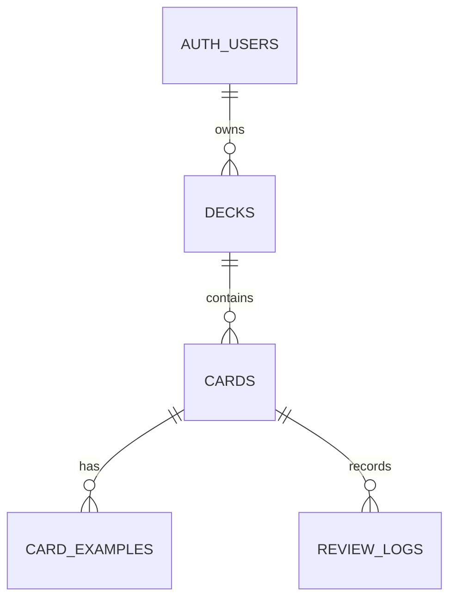
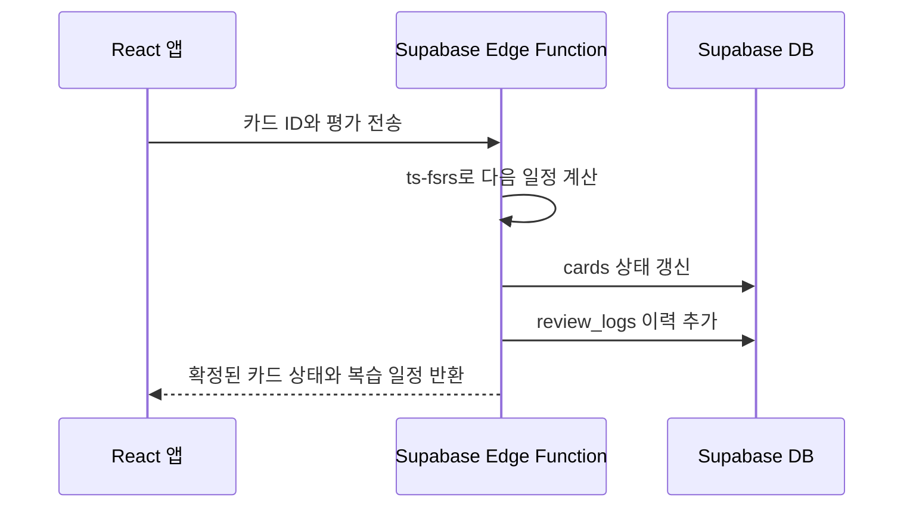

# J-Flashcard

FSRS 기반 복습 기능을 제공하는 일본어 플래시카드 웹 애플리케이션입니다. 단어, 읽기, 뜻, 품사, 예문을 직접 관리하고 `Again`, `Hard`, `Good`, `Easy` 평가에 따라 다음 복습 일정을 계산합니다.

프로젝트의 기능 요구사항은 [Japanese_Flashcard_PRD.md](Japanese_Flashcard_PRD.md), 시각 디자인 기준은 [DESIGN.md](DESIGN.md), 커밋 메시지 규칙은 [COMMIT_CONVENTION.md](COMMIT_CONVENTION.md)에서 확인할 수 있습니다.

## 주요 기능

- Supabase Auth 이메일/비밀번호 로그인 및 로그아웃
- 덱 생성, 조회, 수정, 삭제
- 단어 카드와 복수 예문 생성, 조회, 수정, 삭제
- 카드 앞면/뒷면 3D 전환을 사용하는 학습 화면
- `Again`, `Hard`, `Good`, `Easy` 4단계 평가와 다음 복습 간격 미리보기
- FSRS 기반 복습 일정 계산 및 평가 이력 저장
- 모바일과 데스크톱을 지원하는 반응형 UI

## 첫 릴리스 제외 범위

- Gemini 기반 AI 단어 정보 자동 생성
- JSON Export/Import
- 학습 키보드 단축키
- TTS 음성 재생
- IndexedDB 영속 캐시 및 오프라인 동기화
- FSRS 평가 이력 재계산 UI
- 회원가입, 비밀번호 재설정, 이메일 인증 UI

## 기술 스택

| 영역      | 선택 기술                                 | 역할                                                  |
| --------- | ----------------------------------------- | ----------------------------------------------------- |
| UI        | React, TypeScript, Vite                   | 웹 애플리케이션 개발과 빌드                           |
| 라우팅    | React Router                              | URL 기반 화면 전환                                    |
| 스타일    | Tailwind CSS, Headless UI, Heroicons      | 디자인 시스템 구현과 접근 가능한 상호작용 UI          |
| 서버 상태 | TanStack Query                            | Supabase 데이터 조회, mutation, 세션 내 캐시 갱신     |
| UI 상태   | Zustand                                   | 학습 세션, 카드 앞뒤면, 모달 등 서버와 무관한 상태    |
| 폼과 검증 | React Hook Form, Zod                      | 카드의 예문 배열을 포함한 입력 폼과 타입 안전한 검증  |
| 인증과 DB | Supabase Auth, PostgreSQL                 | 이메일/비밀번호 로그인과 원격 데이터 저장             |
| 접근 제어 | Supabase RLS                              | 로그인 사용자가 본인 데이터만 조회 및 변경하도록 보장 |
| 스케줄링  | ts-fsrs, Supabase Edge Function           | FSRS 계산, 카드 상태 갱신, 평가 이력 저장             |
| 테스트    | Vitest, React Testing Library, Playwright | 단위, 컴포넌트, 핵심 사용자 흐름 테스트               |
| 품질      | ESLint, Prettier                          | 정적 분석과 코드 형식 통일                            |
| 배포      | Vercel                                    | React 정적 프런트엔드 배포                            |

## 아키텍처

도메인 모듈 구조를 사용합니다. 관련 타입, API, UI, 테스트를 하나의 도메인 가까이에 두고, 페이지는 화면 조합과 라우트 파라미터 전달만 담당합니다.

```text
src/
  app/                  # Provider, 라우터, 전역 스타일
  pages/                # URL 단위 화면 조합
  modules/
    auth/               # 인증과 세션
    decks/              # 덱 관리
    cards/              # 카드와 예문 관리
    study/              # 학습 세션, 평가, FSRS
      model/fsrs/       # React와 외부 시스템에 의존하지 않는 순수 로직
  shared/               # 공통 UI, 유틸리티, Supabase 클라이언트
```

### 모듈 규칙

- 의존성은 `app/pages -> modules -> shared` 방향으로만 둡니다.
- `pages`는 Supabase 호출, FSRS 계산, 복잡한 상태 전이를 직접 수행하지 않습니다.
- 다른 모듈은 대상 모듈의 `index.ts`로 공개된 API만 사용하며 내부 파일을 직접 import하지 않습니다.
- 데이터 생성, 수정, 삭제는 해당 데이터를 소유한 모듈의 명령을 통해 수행합니다.
- 세 곳 이상에서 재사용되거나 도메인에 속하지 않는 코드만 `shared`로 이동합니다.
- DB 레코드, 폼 입력값, 화면 표시값은 목적별 타입으로 분리합니다.
- `modules/study/model/fsrs`는 React, Supabase, 브라우저 API에 의존하지 않으며 단위 테스트를 둡니다.

## 데이터 모델

Supabase가 관리하는 `auth.users`를 사용자 계정의 기준으로 사용합니다. 별도의 애플리케이션 `users` 테이블은 첫 릴리스에서 만들지 않습니다.

| 테이블          | 책임                       |
| --------------- | -------------------------- |
| `decks`         | 덱 정보와 소유자 `user_id` |
| `cards`         | 단어 정보와 현재 FSRS 상태 |
| `card_examples` | 카드별 복수 예문과 번역    |
| `review_logs`   | 각 카드 평가의 변경 이력   |

`cards`에는 현재 카드 상태, 기억 안정성(`stability`), 난이도(`difficulty`), 다음 복습일을 저장합니다. `review_logs`에는 `id`, `card_id`, `user_id`, `rating`, `reviewed_at`, `state_before`, `state_after`, `scheduled_days`, `due_at_after`를 저장합니다.



## FSRS 평가 흐름

목표 기억 유지율은 $0.9$로 고정합니다. 카드 평가 시 클라이언트는 Supabase Edge Function을 호출하고, Edge Function은 `ts-fsrs`로 일정을 계산한 뒤 카드 상태와 평가 이력을 함께 저장합니다.



TanStack Query는 Edge Function이 반환한 확정 결과를 바탕으로 관련 덱, 카드, 학습 큐 쿼리를 갱신합니다. Zustand에는 서버 데이터를 복제하지 않고 학습 세션의 UI 상태만 둡니다.

## 보안과 DB 변경 관리

- Supabase Auth의 이메일/비밀번호 인증을 사용합니다.
- 첫 릴리스에서는 회원가입 UI를 제공하지 않습니다. 사용할 계정은 Supabase Dashboard의 Authentication > Users에서 사전 생성합니다.
- 모든 사용자 데이터에 RLS를 적용합니다. 각 사용자는 본인 소유의 덱과 그 하위 카드, 예문, 평가 이력만 접근할 수 있어야 합니다.
- 테이블, 제약 조건, RLS 정책은 Dashboard 수동 설정이 아닌 `supabase/migrations/`의 SQL migration 파일로 관리합니다.
- `service_role` 키는 브라우저와 Vercel 환경 변수에 절대 포함하지 않습니다.

## 환경 구성과 배포

개발은 로컬 Supabase를 사용하고, 실제 데이터는 운영 Supabase 프로젝트에 저장합니다.

| 환경       | 프런트엔드        | Supabase                     |
| ---------- | ----------------- | ---------------------------- |
| Local      | Vite 개발 서버    | 로컬 Supabase                |
| Preview    | Vercel Preview    | UI 확인 전용, 운영 DB 미연결 |
| Production | Vercel Production | 운영 Supabase                |

프로젝트 루트의 환경 변수 파일은 다음 규칙을 따릅니다.

```text
.env.example       # Git에 커밋하는 빈 템플릿
.env.local         # Git에서 제외하는 로컬 실제 값
```

프런트엔드에는 아래의 공개 값만 사용합니다.

```dotenv
VITE_SUPABASE_URL=
VITE_SUPABASE_ANON_KEY=
```

`VITE_` 접두사가 있는 변수는 브라우저 번들에 포함됩니다. Supabase `anon key`는 RLS와 함께 사용하도록 설계된 공개 클라이언트 키이지만, `service_role` 키나 미래의 `GEMINI_API_KEY` 같은 비밀 값은 Supabase Edge Function Secret으로만 관리합니다.

## 테스트와 품질

TDD를 기본 개발 방식으로 사용합니다. 기능 구현은 실패하는 테스트 작성, 최소 구현, 리팩터링 순서로 진행합니다.

- Vitest: FSRS, 입력 검증, 데이터 변환 등 순수 로직 단위 테스트
- React Testing Library: 폼과 화면 컴포넌트 동작 테스트
- Playwright: 로그인, 덱/카드 관리, 카드 평가 같은 핵심 사용자 흐름 E2E 테스트
- ESLint와 Prettier: 코드 품질과 형식 검사

## 커밋 규칙

Conventional Commits 형식을 사용합니다. `type`은 영어로, 요약은 일본어로 작성합니다.

```text
feat: 学習カードの裏面表示を追加
fix: 復習日の計算結果が保存されない問題を修正
```

자세한 규칙은 [COMMIT_CONVENTION.md](COMMIT_CONVENTION.md)를 참고합니다.
